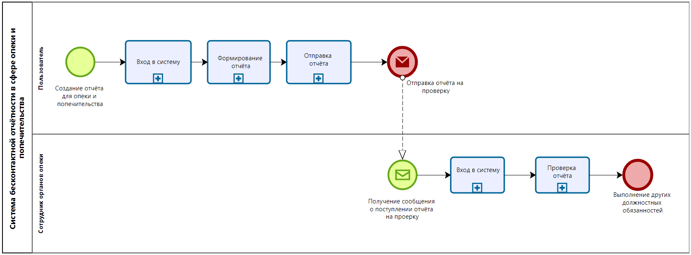
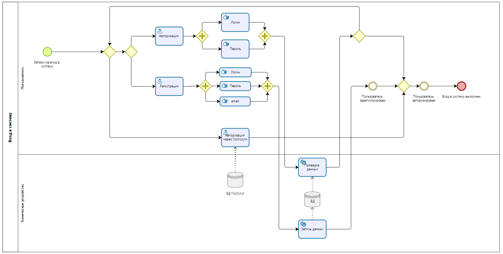
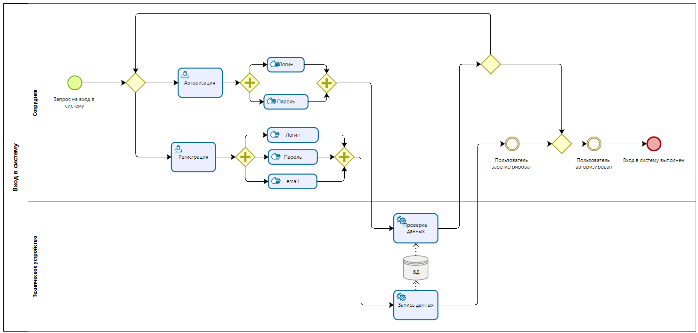
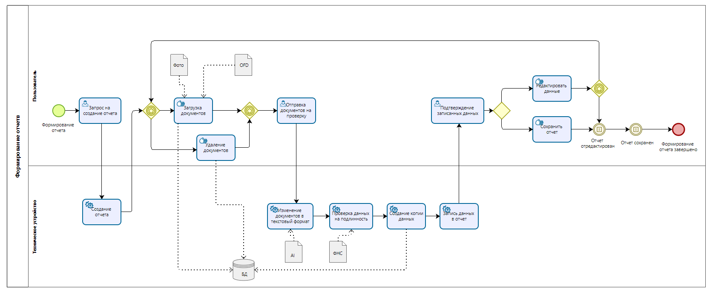

# 2.	ОПИСАНИЕ БИЗНЕС-ПРОЦЕССОВ
## 2.1.	Общая диаграмма процессов
  
Рисунок 1 - Верхнеуровневая диаграмма бизнес-процессов, поддерживаемых системой.

## 2.2.	Бизнес-процесс "Вход в систему"
### 2.2.1. Диаграмма бизнес-процесса "Вход в систему" для пользователя

Рисунок 2 – Диаграмма бизнес-процесса "Вход в систему" для пользователя

### 2.2.2.	Описание функций бизнес-процесса "Вход в систему" для пользователя.
Таблица 1 – Описание функций бизнес-процесса "Вход в систему" для пользователя. 
| Наименование функции | Вход в систему |
|----|----|
| **Роли пользователей, участвующих в выполнении функции** | Пользователь, Техническое утройство|
| **Входные данные функции** | Запрос на вход в систему |
| **Описание действия** | Пользователь делает запрос на вход в систему, и попадает в выборное меню, где может авторизироваться, зарегистрироваться и проти авторизацию через ГосУслуги. Если он проходит авторизицию успешно, система открывает доступ к её функционалу, если же нет, попадает на самое выборное меню.    |
| **Выходные данные функции** | Вход в систему выполнен |

### 2.2.3. Диаграмма бизнес-процесса "Вход в систему" для сотрудника

Рисунок 3 – Диаграмма бизнес-процесса "Вход в систему" для сотрудника

### 2.2.4.	Описание функций бизнес-процесса "Вход в систему" для сотрудника.
Таблица 2 – Описание функций бизнес-процесса "Вход в систему" для сотрудника. 
| Наименование функции | Вход в систему |
|----|----|
| **Роли пользователей, участвующих в выполнении функции** | Сотрудник, Техническое утройство|
| **Входные данные функции** | Запрос на вход в систему |
| **Описание действия** | Сотрудник делает запрос на вход в систему, и попадает в выборное меню, где может авторизироваться или зарегистрироваться. Если он проходит авторизицию успешно, система открывает доступ к её функционалу, если же нет, попадает на самое выборное меню.    |
| **Выходные данные функции** | Вход в систему выполнен |  

## 2.3.	<Бизнес-процесс >
### 2.3.1. Диаграмма бизнес-процесса "Формирование отчёта"    

Рисунок 4 – Диаграмма бизнес-процесса "Формирование отчета"

### 2.3.2.	Описание процесса 2

### 2.3.3.	Описание функций бизнес-процесса 2

Таблица 2 – Описание функций процесса 2

| Наименование функции | .... |
|----|----|
| **Роли пользователей, участвующих в выполнении функции** | .... |
| **Входные данные функции** | .... |
| **Описание действия** | .... |
| **Выходные данные функции** | .... |

## 2.4.	Бизнес-процесс "Вход в систему"
### 2.4.1. Диаграмма бизнес-процесса 1 

Рисунок 5 – Диаграмма бизнес-процесса "Авторизация пользователя"

### 2.4.2.	Описание процесса 1

### 2.4.3.	Описание функций бизнес-процесса 1

Таблица 1 – Описание функций процесса 1  
| Наименование функции | *[Наименование функции]* |
|----|----|
| **Роли пользователей, участвующих в выполнении функции** | *[Все роли, участвующие в выполнении функции. При необходимости может указываться степень ответственности для каждой роли]* |
| **Входные данные функции** | *[Информация, поступающая на вход выполнения функции]* |
| **Описание действия** | *[Порядок действий при выполнении функции. Необходимые условия. Начальное и конечное событие функции]* |
| **Выходные данные функции** | *[Выходная информация, получающаяся в результате выполнения функции]* |
