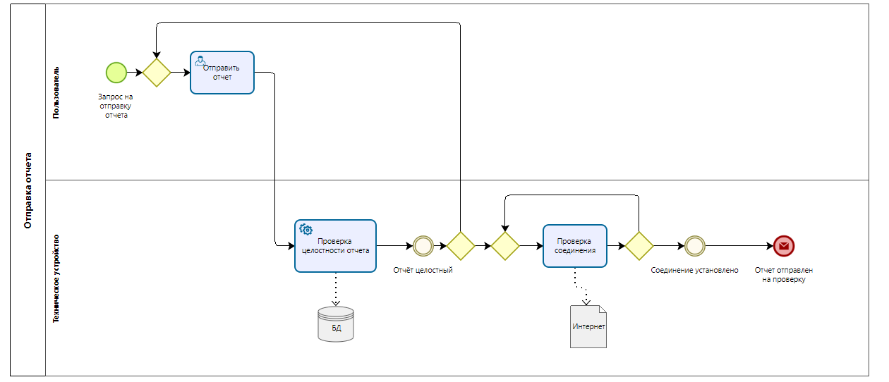
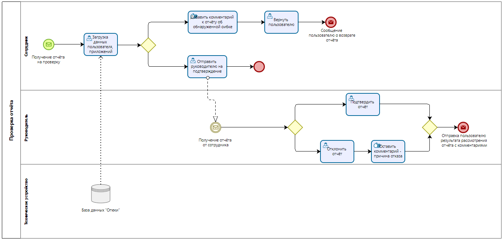

# 2.	ОПИСАНИЕ БИЗНЕС-ПРОЦЕССОВ
## 2.1.	Общая диаграмма процессов
  
Рисунок 1 - Верхнеуровневая диаграмма бизнес-процессов, поддерживаемых системой.

## 2.2.	Бизнес-процесс "Вход в систему"
### 2.2.1. Диаграмма бизнес-процесса "Вход в систему" для пользователя

Рисунок 2 – Диаграмма бизнес-процесса "Вход в систему" для пользователя

### 2.2.2.	Описание процесса "Вход в систему" для пользователя.
У пользователя возникает необходимость создать отчёт для органов Опеки и попечительства. Для этого неоходимо войти в систему. Вход в систему возможен как для зарегистрированных ранее пользователей, так и для тех, кто впервые решил воспользоваться системой. Для зарегистрированных пользователй возможна авторизация по логину/паролю, а так же аутентификация и авторизация через сервис ГосУслуги. В случае успешной авторизации, пользователь получит доступ к системе, иначе - возврат к выборному меню. Новому пользователю необходимо зарегистрироваться в системе для получения доступа.  

### 2.2.3.	Описание функций бизнес-процесса "Вход в систему" для пользователя.  
Таблица 1 – Описание функций бизнес-процесса "Вход в систему" для пользователя. 
| Наименование функции | Вход в систему |
|----|----|
| **Роли пользователей, участвующих в выполнении функции** | Пользователь, Техническое утройство|
| **Входные данные функции** | Запрос на вход в систему |
| **Описание действия** | Пользователь делает запрос на вход в систему, и попадает в выборное меню, где может авторизироваться, зарегистрироваться и проqти авторизацию через ГосУслуги. Если он проходит авторизицию успешно, система открывает доступ к её функционалу, если же нет, попадает на самое выборное меню. |
| **Выходные данные функции** | Вход в систему выполнен |

### 2.2.4. Диаграмма бизнес-процесса "Вход в систему" для сотрудника

Рисунок 3 – Диаграмма бизнес-процесса "Вход в систему" для сотрудника

### 2.2.5.	Описание процесса "Вход в систему" для сотрудника.
Получив сообщение от системы о поступлении отчёта на проверку сотруднику органов опеки нужно войти в систему, для этого он должен пройти процедуру авторизации по логину/паролю либо зарегистрироваться.  

### 2.2.6.	Описание функций бизнес-процесса "Вход в систему" для сотрудника.
Таблица 2 – Описание функций бизнес-процесса "Вход в систему" для сотрудника. 
| Наименование функции | Вход в систему |
|----|----|
| **Роли пользователей, участвующих в выполнении функции** | Сотрудник, Техническое утройство |
| **Входные данные функции** | Запрос на вход в систему |
| **Описание действия** | Сотрудник делает запрос на вход в систему, и попадает в выборное меню, где может авторизироваться или зарегистрироваться. Если он проходит авторизицию успешно, система открывает доступ к её функционалу, если же нет, попадает на самое выборное меню. |
| **Выходные данные функции** | Вход в систему выполнен |  

## 2.3.	Бизнес-процесс "Формирование отчёта"
### 2.3.1. Диаграмма бизнес-процесса "Формирование отчёта"    

Рисунок 4 – Диаграмма бизнес-процесса "Формирование отчета"

### 2.3.2.	Описание процесса "Формирование отчёта"
После входа в систему пользователь может приступить к формированию отчёта для органов Опеки и попечительства. По нажатию кнопки "Создать отчёт", система создаёт шаблон отчёта, куда подгружает уже имеющиеся у неё данные, а так же предлагает пользователю загрузить подтверждающие траты документы (фото, OFD), так же у пользователя есть возможность удалить загруженные приложения. После загрузки приложений система переводит приложения в текстовый формат и проводит проверку подлинности платёжных документов по базе ФНС, создаёт копию и загружает данные в отчёт. Ознакомившись с отчётом, пользователь может внести изменения или сохранить отчёт. На этом бизнес-процесс "Формирование отчета" завершён.  

### 2.3.3.	Описание функций бизнес-процесса "Формирование отчёта"
Таблица 3 – Описание функций бизнес-процесса "Формирование отчёта"
| Наименование функции | Формирование отчёта |
|----|----|
| **Роли пользователей, участвующих в выполнении функции** | Пользователь, Техническое утройство |
| **Входные данные функции** | Запрос на формирование отчёта |
| **Описание действия** | Запрос на формирование отчёта, предоставление шаблона отчёта пользователю. Пользователь может загрузить приложения (фото, OFD), а так же удалить имеющиеся. Система проводит проверку подлинности данных и заноссит данные в отчёт. после ознакомления с отчётом пользователь может сохранить отчёт, либо внести изменения, повторив все действия с момента загрузки приложений. |
| **Выходные данные функции** | Отчёт сформирован |

## 2.4.	Бизнес-процесс "Отправка отчёта"
### 2.4.1. Диаграмма бизнес-процесса "Отправка отчёта"    

Рисунок 5 – Диаграмма бизнес-процесса "Отправка отчёта"

### 2.4.2.	Описание процесса "Отправка отчёта" 
После формирования отчёта пользователь отправляет его на проверку. Система проверяет отчёт на целостность и соответствие введённых данных и данных в БД. Система проверяет наличие соединения и отправляет отчёт сотруднику.
### 2.4.3.	Описание функций бизнес-процесса "Отправка отчёта"  
Таблица 4 – Описание функций бизнес-процесса "Отправка отчёта" 
| Наименование функции | Отправка отчёта |
|----|----|
| **Роли пользователей, участвующих в выполнении функции** | Пользователь, Техническое утройство |
| **Входные данные функции** | Запрос на отправку отчёта |
| **Описание действия** | Пользователь отправляет отчёт. Система проверяет соответствие введённых данных с данными в БД, наличие интернет-соединения и отправляет отчёт сотруднику |
| **Выходные данные функции** | Отчёт отправлен |

## 2.5.	Бизнес-процесс "Проверка отчёта"
### 2.5.1. Диаграмма бизнес-процесса "Проверка отчёта"    

Рисунок 6 – Диаграмма бизнес-процесса "Проверка отчёта"

### 2.5.2.	Описание процесса "Проверка отчёта"  
Сотрудник получает отчёт для проверки, загружает данные пользователя и приложения с БД для проверки. Если в ходе проверки обнаружены ошибки, то сотрудник оставляет комментарий для пользователя и возвращает отчёт пользователю на доработку. Если отчёт прошел проверку, то дальше его необходимо утвердить у руководителя - отчёт направляется руководителю. При обнаружении ошибок, неточностей или неправомерных трат, руководитель отклоняет отчёт, оставляя комментарий. Если ошибки не обнаружены, отчёт подтверждается руковдителем. Результат рассмотрения отчёта с комментариями отправляется пользователю.
### 2.5.3.	Описание функций бизнес-процесса "Проверка отчёта"  
Таблица 5 – Описание функций бизнес-процесса "Проверка отчёта"  
| Наименование функции | "Проверка отчёта" |
|----|----|
| **Роли пользователей, участвующих в выполнении функции** | Сотрудник, Руководитель, Техническое утройство |
| **Входные данные функции** | Получение отчёта на проверку |
| **Описание действия** | Порядок действий при выполнении функции в роли сотрудника: получает отчёт, загружает данные с БД и сверяет их с отчётом, уведомление пользователя (если найдены ошибки), отправка отчёта руководителю на подтверждение. Начальное событие функции: получение отчёта на проверку. Конечное событие функции: передать отчёт руководителю (в случае, если в отчёте нет ошибок). Порядок действий при выполнении функции в роли руководителя: получение отчёта, проверка, подтверждение отчёта (если нет ошибок), отклонение отчёта с описанием (если найдены ошибки), отправка пользователю результата рассмотрения отчёта с комментариями. Начальное событие функции: получение отчёта. Конечное событие функции: Отправка пользователю результата рассмотрения отчёта с комментариями. |
| **Выходные данные функции** | Отправка пользователю результата рассмотрения отчёта с комментариями |