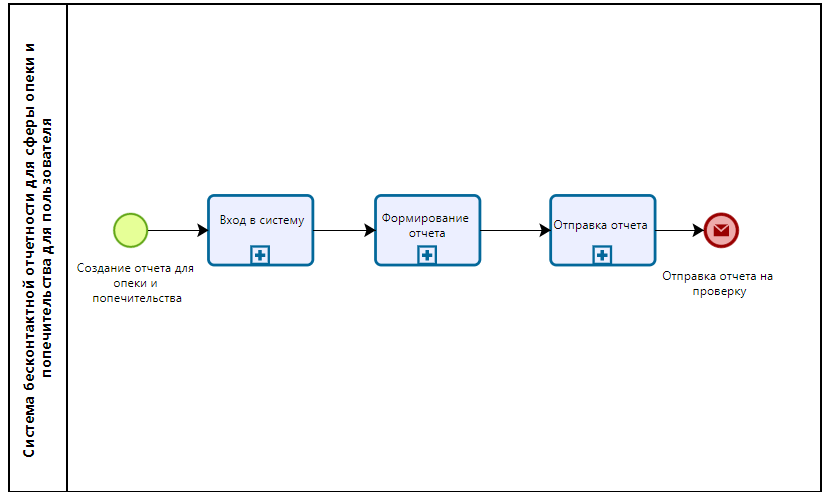

# 2.	ОПИСАНИЕ БИЗНЕС-ПРОЦЕССОВ
*[Описать не менее трех бизнес-процессов системы.]*

## 2.1.	Общая диаграмма процессов
*[Необходимо построить верхнеуровневую диаграмму бизнес-процессов, поддерживаемых системой. Она позволяет получить общее представление о масштабе и скопе проекта, а также представить иерархию бизнес-процессов. Раздел заполняется опционально.]*  

.png)

## 2.2.	<Бизнес-процесс 1>
### 2.2.1. Диаграмма бизнес-процесса 1 
*[Графическое изображение бизнес-процесса, желательно в нотации BPMN. Диаграмма должна отражать ход выполнения процесса, условия ветвления, важные для процесса события, роли, входную и выходную информацию.*  
*Пример описания процесса «Согласование отпуска» в нотации BPMN приведен ниже. Если необходимо отразить процесс в разрезе ролей, необходимо использовать пулы и дорожки.]*  

.png)
Рисунок 1 – Диаграмма бизнес-процесса 1

### 2.2.2.	Описание процесса 1
*[Текстовое описание технологии выполнения процесса, написанное естественным языком. Описание вкратце должно дать понятие, как выполняется бизнес-процесс.]*
.png)

### 2.2.3.	Описание функций бизнес-процесса 1
*[В табличном виде дается описание каждой основной функции бизнес-процесса.
Формат описания приведен ниже.]*  

Таблица 1 – Описание функций процесса 1  
| Наименование функции | *[Наименование функции]* |
|----|----|
| **Роли пользователей, участвующих в выполнении функции** | *[Все роли, участвующие в выполнении функции. При необходимости может указываться степень ответственности для каждой роли]* |
| **Входные данные функции** | *[Информация, поступающая на вход выполнения функции]* |
| **Описание действия** | *[Порядок действий при выполнении функции. Необходимые условия. Начальное и конечное событие функции]* |
| **Выходные данные функции** | *[Выходная информация, получающаяся в результате выполнения функции]* |

## 2.3.	<Бизнес-процесс >
### 2.3.1. Диаграмма бизнес-процесса  

*[Привести рисунок 3, на котором будет представлена диаграмма бизнес-процесса 2.]*

### 2.3.2.	Описание процесса 2

### 2.3.3.	Описание функций бизнес-процесса 2

Таблица 2 – Описание функций процесса 2

| Наименование функции | .... |
|----|----|
| **Роли пользователей, участвующих в выполнении функции** | .... |
| **Входные данные функции** | .... |
| **Описание действия** | .... |
| **Выходные данные функции** | .... |

## 2.4.	<Бизнес-процесс N>
### 2.4.1. Диаграмма бизнес-процесса N  

*[Привести рисунок 4, на котором будет представлена диаграмма бизнес-процесса N.]*

### 2.4.2.	Описание процесса N

### 2.4.3.	Описание функций бизнес-процесса N

Таблица 3 – Описание функций процесса N  
| Наименование функции | .... |
|----|----|
| **Роли пользователей, участвующих в выполнении функции** | .... |
| **Входные данные функции** | .... |
| **Описание действия** | .... |
| **Выходные данные функции** | .... |

