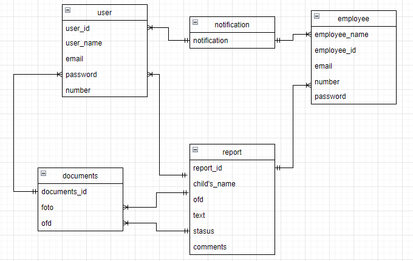
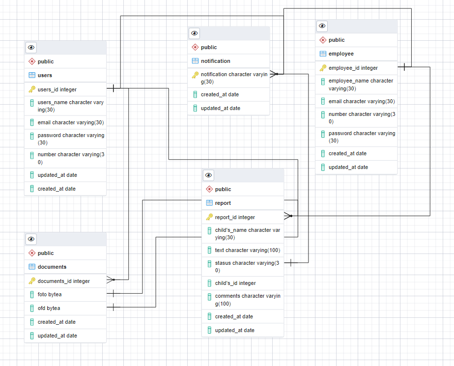

# 3. ОПИСАНИЕ СУЩНОСТЕЙ СИСТЕМЫ
## 3.1.	Сущности предметной области "Формирование отчета"
### 3.1.1.	Логическая схема предметной области "Формирование отчета"  

Рисунок 1 – Логическая схема предметной области "Формирование отчета"

Таблица 1 – Описание атрибутов сущности предметной области 1
| № п/п | Атрибут | Обязательность | Тип данных |
|----|----|----|----|
| 1 |   |   |  |
| 2 |   |   |   |
| 3 |   |   |   |

###3.1.2.	Физическая модель данных предметной области 1  
*[При построении физической модели данных необходимо придерживаться следующих требований:*
* *Необходимо построить не всю физическую модель данных, полностью соответствующую логической, а лишь выбранный фрагмент;*
* *Наименование сущностей и атрибутов в БД указывается в стиле «AttributeName» – на английском языке и без пробелов, чтобы в дальнейшем избежать лишних символов, мешающих при написании алгоритмов и формул;*
* *На диаграмме у сущности обязательно отображать ключевые атрибуты и атрибуты, необходимые для связи с другими сущностями (PK и FK).  Если в сущности на диаграмме указаны не все атрибуты, следует в сущность на диаграмме добавить нижнюю строку с троеточием. Полный атрибутный состав сущности должен быть описан в таблице;*
* *Для каждого атрибута указывается тип данных;*
* *Обязательно указание размерности связи (один к одному, один ко многим, многие ко многим), кроме связи наследования.*

*Пример фрагмента схемы физической модели данных «Автоколонна» и формат описания атрибутов таблицы БД приведены далее.]*  

!  
Рисунок 1 – Физическая модель данных предметной области "Формирование отчета"

Таблица 2 – Описание атрибутов таблицы БД предметной области 1
| № п/п | Атрибут | Наименование в БД | Обязательность | Тип данных в БД и длина | Комментарии, правила валидации |
|----|----|----|----|----|----|
| 1 |   |   |  | *[Типы данных char, int, float, date и т.д.]* |  |
| 2 |   |   |   |   |   |
| 3 |   |   |   |   |   |

### 3.1.3.	SQL-запрос для предметной области 1
*[Необходимо написать SQL-запрос, который воссоздаст фрагмент БД по приведенной выше физической модели данных. Каждую таблицу следует наполнить минимум тремя записями.]*

## 3.2.	Сущности предметной области 2
### 3.2.1.	Логическая схема предметной области 2

Следует привести рисунок, на котором будет представлена логическая схема предметной области 2.

Таблица 3 – Описание атрибутов сущности предметной области 1
| № п/п | Атрибут | Обязательность | Тип данных |
|----|----|----|----|
| 1 |   |   | *[Строка, число, дата, логический ]* |
| 2 |   |   |   |
| 3 |   |   |   |

### 3.2.2.	Физическая модель данных предметной области 2

Следует привести рисунок, на котором будет представлена физическая модель данных предметной области 2.

Таблица 4 – Описание атрибутов таблицы БД предметной области 2
| № п/п | Атрибут | Наименование в БД | Обязательность | Тип данных в БД и длина | Комментарии, правила валидации |
|----|----|----|----|----|----|
| 1 |   |   |  | *[Типы данных char, int, float, date и т.д.]* |  |
| 2 |   |   |   |   |   |
| 3 |   |   |   |   |   |

### 3.2.3.	SQL-запрос для предметной области 2

## 3.3.	Сущности предметной области N
### 3.3.1.	Логическая схема предметной области N

Следует привести рисунок, на котором будет представлена логическая схема предметной области N.

Таблица 5 – Описание атрибутов сущности предметной области 1
| № п/п | Атрибут | Обязательность | Тип данных |
|----|----|----|----|
| 1 |   |   | *[Строка, число, дата, логический ]* |
| 2 |   |   |   |
| 3 |   |   |   |

### 3.3.2.	Физическая модель данных предметной области N

Следует привести рисунок, на котором будет представлена физическая модель данных предметной области N.

Таблица 6 – Описание атрибутов таблицы БД предметной области N
| № п/п | Атрибут | Наименование в БД | Обязательность | Тип данных в БД и длина | Комментарии, правила валидации |
|----|----|----|----|----|----|
| 1 |   |   |  | *[Типы данных char, int, float, date и т.д.]* |  |
| 2 |   |   |   |   |   |
| 3 |   |   |   |   |   |

### 3.3.3.	SQL-запрос для предметной области N